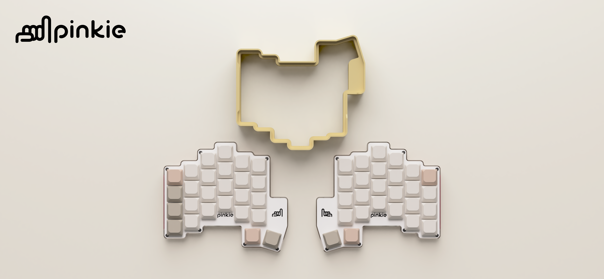

# pinkie


<div align="center">
<p>a portable, wireless, ergonomic split keyboard.</p>
</div>

[](https://www.buymeacoffee.com/scryagain)

---

> [!CAUTION]
> **pre-validation release.** the ordered PCB prototype has not been received yet. functionality is unconfirmed. files may change.

---

## what is pinkie?

pinkie is an ergonomic split keyboard designed to go wherever you do. The two halves clip into a travel bracket with the keys facing inward, keeping it compact and protected on the move. It runs wirelessly on ZMK firmware with low profile gateron switches, a reversible PCB that builds both halves from a single board, and a case you can 3D print or CNC mill yourself.

For more information visit ["https://pinkie.gabrielschmitz.de"](https://pinkie.gabrielschmitz.de)

---

## what's in this repo

```
/3D            STEP and STL files for the case and travel bracket
/pcbs          gerber files for the PCB
/plates        gerber files for the top plate
/docs          documentation and build resources
README.md      you are here
```

---

## bill of materials

| part | quantity | notes | link |
|------|----------|-------|------|
| pinkie PCB | 2 | order from gerber files, same board for both halves | [files](/pcbs) |
| pinkie top plate | 2 | order from gerber files, same plate for both halves | [files](/plates) |
| Gateron KS-33 switches | 52 | low profile | [link](https://www.gateron.com/products/gateron-ks-33-low-profile-20-strawberry-chocolate-linear-switch-set?VariantsId=11590) |
| Gateron low profile hot swap sockets 2.0 | 52 | optional | [link](https://www.gateron.com/products/gateron-low-profile-switch-hot-swap-pcb-socket?VariantsId=10234) |
| diodes | 52 | 1N4148W SOD-123 | [link](https://www.lcsc.com/product-detail/C81598.html) |
| reset button | 2 | optional | [link](https://www.lcsc.com/product-detail/C2834918.html) |
| JST 1.25mm 2P connector | 2 | optional | [link](https://www.lcsc.com/product-detail/C668614.html) |
| M2x10 screws | 14 | ultra thin head recommended | [link](https://de.aliexpress.com/item/1005006332971390.html) |
| nice!nano v2 | 2 | or compatible pinout | |
| 3.7V lipo battery | 2 | 303450 recommended | |
| 3D printed lipo bracket | 2 | made for 303450, but super easy to adjust | [files](/3D) |
| 3D printed or CNC milled case | 1 left, 1 right | | [files](/3D) |
| 3D printed travel bracket | 1 | best results with PETG as support interface when printing in PLA and vice versa. print in place magnet pockets via pausing. | [files](/3D) |
| round magnets 10 x 3mm | 4 | | |
| round magnets 10 x 1mm | 4 | | |

---

## guide

available as soon as my PCB order arrives and everything is tested and validated.

---

## firmware

available as soon as my PCB order arrives and everything is tested and validated.

---

## licensing

- **hardware** (design files, CAD, gerbers) — [CC-BY-4.0](LICENSE_CC)
- **ZMK config** — [MIT](LICENSE_MIT)